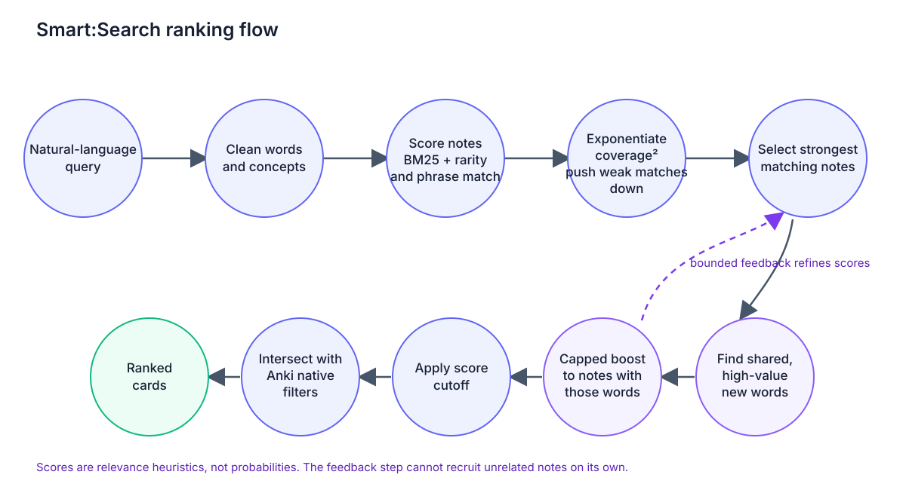
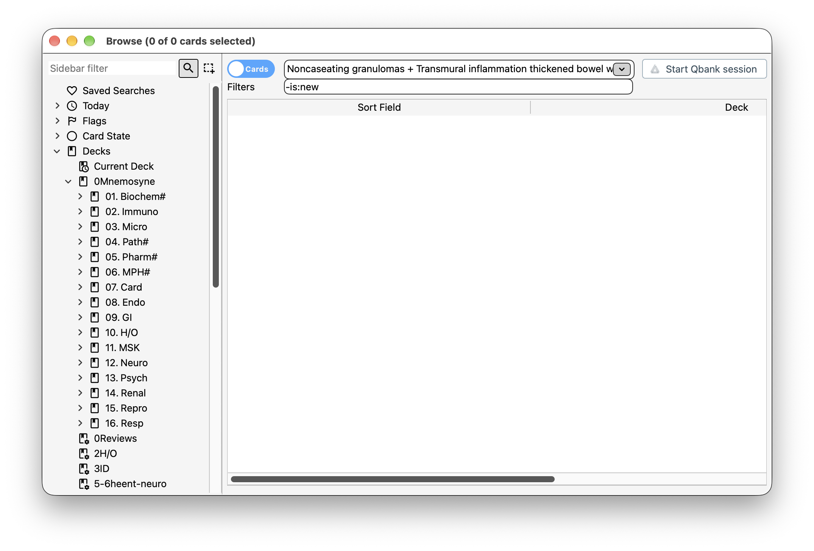
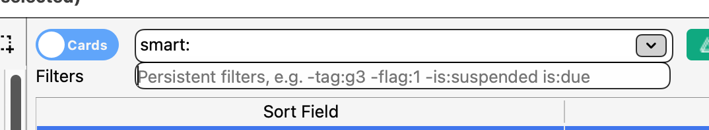
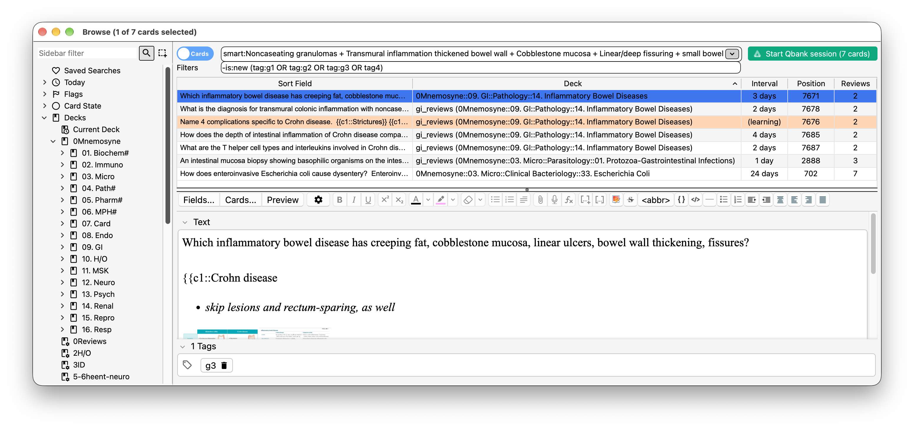

# Smart:Search

An Anki Browser add-on that ranks notes by relevance to a natural-language query. The default release uses local lexical ranking and requires no external packages or model download.

## Install

In Anki, open **Tools → Add-ons → Get Add-ons** and install the add-on using its AnkiWeb code once published. Restart Anki, open Browse, and prefix the main search with `smart:`. For example:

```text
smart:Noncaseating granulomas + transmural inflammation + cobblestone mucosa
```

The **Filters** field accepts regular Anki search terms such as `-flag:1` and is saved between Browser sessions. Without `smart:`, the main field keeps normal Anki search behavior.

## Search behavior

- Ranks the active collection and then intersects results with native Anki filters.
- Scores notes rather than treating sibling cards as separate evidence.
- Uses whole-token matching, curated synonyms, conservative typo correction, rarity weighting, and a bounded feedback pass.
- Suppresses results below 15% of the top score. Scores are heuristics, not probabilities.
- Does not modify notes, cards, or scheduling.

## How it works

Smart:Search starts by looking across your notes for the ideas in your query. It cleans up the text, recognizes a few curated synonyms, and gives rarer terms more weight. That helps a distinctive clue count more than a common word.

Then it looks at how much of your query each note covers. Coverage is squared, so a note matching many of the query’s concepts gets favored over one matching only a small part. You can think of the exponent as sharpening that preference: partial matches lose ground, while strong, broad matches stand out. It isn’t literally turning scores into probabilities, though; these are relevance scores.

There’s also a feedback step. Smart:Search takes the strongest initial matches and looks for useful words they share that weren’t in your original query. It only keeps words that show up repeatedly in those strong notes and are unusually common there compared with the rest of the collection. Those words then give a small boost to notes that also contain them, helping surface related cards.

That second step is deliberately bounded. The new words can refine the ranking, but they can’t pull in an unrelated note by themselves. Finally, the results are filtered through Anki’s native filters, grouped around notes so sibling cards don’t count as separate evidence, and weak matches below the score cutoff are removed.



### Screenshots

**Without Smart:Search:** the regular query returns no cards.



**How to use it:** type `smart:` in the main Browser search field; put persistent native constraints in **Filters**.



**Ranked results:** the expanded query finds related cards and shows them in the Browser.



## Compatibility and limits

This add-on targets current Anki desktop builds. Search indexes the collection synchronously each time, which may pause the Browser for large collections.

## Development

The add-on package is built from the runtime files in `smart_relevance_search/`. The internal Anki add-on package folder remains `smart_relevance_search` for compatibility. See [smart_relevance_search/README.md](smart_relevance_search/README.md) for implementation and validation notes. Tests are in `tests/`.

To build the AnkiWeb upload archive from the repository root:

```sh
mkdir -p release
(cd smart_relevance_search && zip -X -j ../release/Smart-Search.ankiaddon __init__.py engine.py semantic.py config.json)
```

The archive must contain the add-on files at its root; do not include the enclosing folder, `__pycache__`, backups, tests, or semantic dependencies. Then sign in to [AnkiWeb's shared add-ons page](https://ankiweb.net/shared/addons/), choose **Upload**, and upload the `.ankiaddon` file with the title, description, and compatibility details.

The source repository is [Smart:Search on GitHub](https://github.com/shubhamsinghcol/smart-search). The repository URL uses `smart-search` because GitHub repository names use URL-safe slugs.

No software license has been selected. Until one is added, the source is public for viewing, but reuse and redistribution are not granted.
