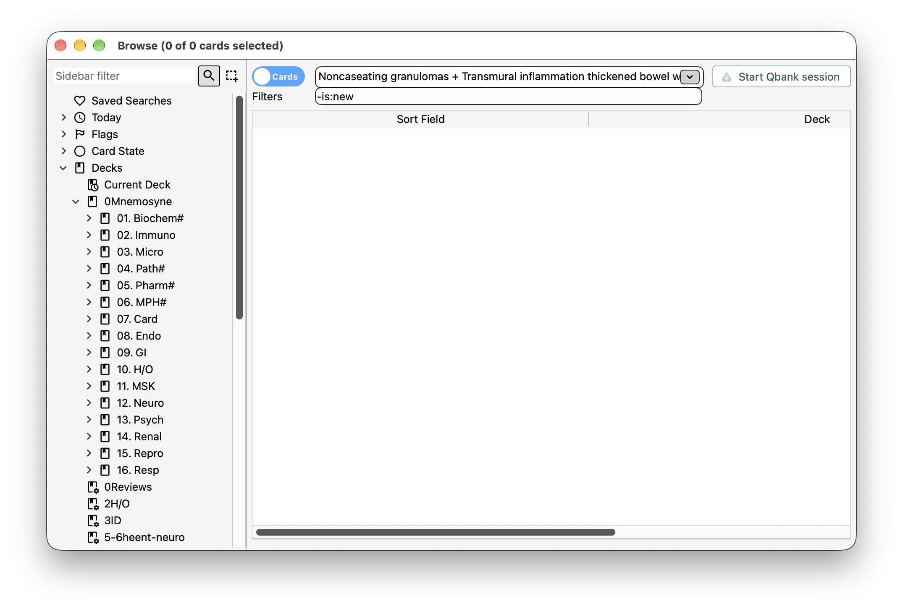
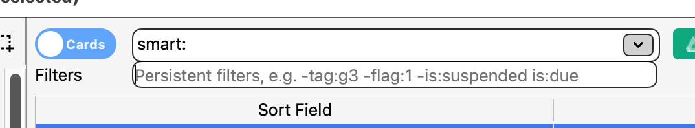
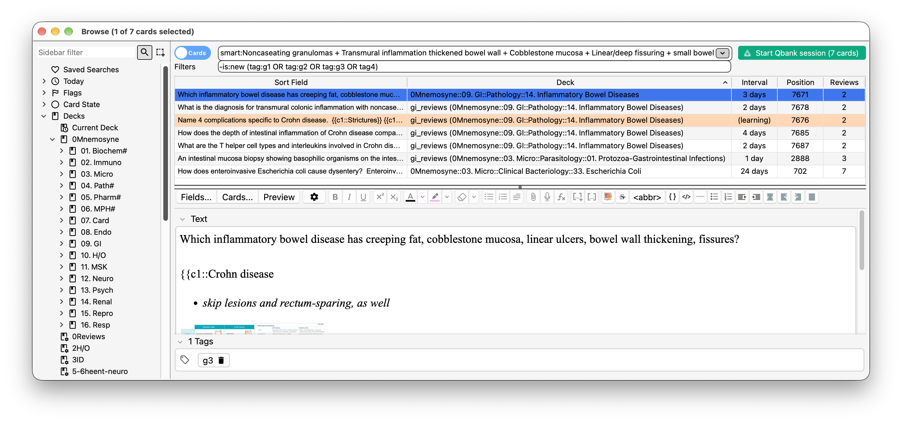

# Smart:Search

**Search your Anki collection with clues, not exact wording.**

Smart:Search is a Browser add-on that ranks notes by relevance to a natural-language query. It can find cards even when no single note contains everything you typed.

```text
smart:transmural inflammation cobblestoning
```

## What it does

- Ranks notes by relevance without requiring every clue to appear in every note.
- Recognizes medical synonyms, abbreviations, and generic/brand drug names.
- Uses disease–finding relationships to connect related cards.
- Handles long notes by matching individual passages, weighting main fields and early text more heavily.
- Uses decks and tags as supporting context, including collections that use both.
- Optionally matches differently worded clues with a local semantic model.

## Install and first search

1. In Anki, open **Tools → Add-ons → Get Add-ons** and enter **1117931988**. [AnkiWeb listing](https://ankiweb.net/shared/info/1117931988).
2. Restart Anki, open **Browse**, and type `smart:` followed by your clues.
3. Put persistent restrictions like `-flag:1` in the **Filters** field.

Without the `smart:` prefix, the search box behaves like normal Anki.

The packaged add-on is also available under [GitHub Releases](https://github.com/shubhamsinghcol/smart-search/releases). Download the `.ankiaddon` file, rather than GitHub's automatically generated source ZIP.

## Semantic model (optional)

Go to **Tools → Smart Search options** and click **Download semantic model (67 MB)**. Once installed, semantic matching turns on automatically. If the model is missing or unavailable, Smart:Search falls back to text search.

No Ollama, generative LLM, API key, or paid AI service is required.

## How it works

Smart:Search builds local indexes of your notes and medical terminology, finds notes that match your clues by wording, related terms, and meaning, and ranks the strongest matches first. Indexes are built in the background and reused across searches. It never modifies notes, cards, or scheduling.

## Settings

The options page lets you download the model, rebuild indexes, enable or disable semantic matching, and adjust relevance controls. Each Anki profile keeps its own settings, indexes, and embedding cache. The downloaded model is shared locally across profiles.

## Privacy

Searching, indexing, and embeddings all run on your machine. The semantic model download contacts Hugging Face to retrieve model files. Smart:Search does not upload your queries or collection contents.

## Compatibility and limits

- Bundled runtimes target **Windows x64** and **Apple Silicon Macs**, using Anki's **Python 3.13** runtime.
- The current AnkiWeb compatibility range is **Anki 26.05–26.09**. Apple Silicon runtime binaries require macOS 14 or later.
- Intel Macs, Windows ARM64, and Linux are not supported by the bundled semantic runtime.
- Windows support is new and has not yet been verified in a live Windows Anki installation. Please [report issues](https://github.com/shubhamsinghcol/smart-search/issues).
- Initial preparation of large collections takes time. Background preparation and caches reduce repeated work; no specific speed or accuracy improvement is claimed.
- Scores are relevance heuristics, not probabilities or diagnostic advice.

## Screenshots

These screenshots show the earlier Browser interface; updated screenshots of the redesigned interface are pending.

**Normal search:**



**Smart search and persistent filters:**



**Ranked results:**



## Development

The current release uses persistent local text indexes and cached passage embeddings. Retrieval combines medical terminology, text matching, semantic matching, and collection metadata; internal ranking constants are intentionally omitted here.

The downloadable release is newer than the source currently published in this repository. Build scripts and the expanded test suite belong to the current development checkout; that source update is pending. The development checkout uses:

```sh
python3 -m unittest discover -s tests
python3 scripts/build_addon.py
```

Packages exclude private collection caches, notes, and cards. Semantic runtime dependencies are bundled; the model is a separate download.

### Credits and third-party resources

- **Mondo Disease Ontology**, Monarch Initiative: [project](https://mondo.monarchinitiative.org/), CC BY 4.0.
- **Human Phenotype Ontology (HPO)** and phenotype annotations: this product uses HPO. [Project and terms](https://hpo.jax.org/), [citation](https://doi.org/10.1093/nar/gkad1005). The terminology pack uses HPO 2026-09-01 and annotations 2026-09-02.
- **NLM RxNorm Current Prescribable Content**: [resource](https://www.nlm.nih.gov/research/umls/rxnorm/docs/prescribe.html), used for drug terminology.
- **BGE-small-en-v1.5**: [embedding model](https://huggingface.co/BAAI/bge-small-en-v1.5), MIT license; local inference uses FastEmbed and ONNX Runtime.

Third-party data, models, and dependencies retain their respective licenses and notices, included with the package. These terms are separate from the add-on's own code.

## License

No open-source license has been granted for the author's original code. Public visibility does not grant general permission to reuse or redistribute it. Third-party components retain their own licenses.
